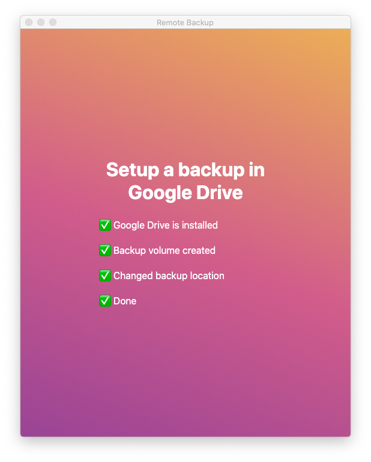

# Remote Backup
<div align="center">
  
</div>

This APP creates an encrypted volume inside the Google Drive, mounts it and uses it as the MacOS TimeMachine backup destintation.

## Starting Development

Start the app in the `dev` environment:

```bash
yarn start
```

## Packaging for Production

To package apps for the local platform:

```bash
yarn package
```

This project is based on [electron-react-boilerplate](https://github.com/electron-react-boilerplate/electron-react-boilerplate).
